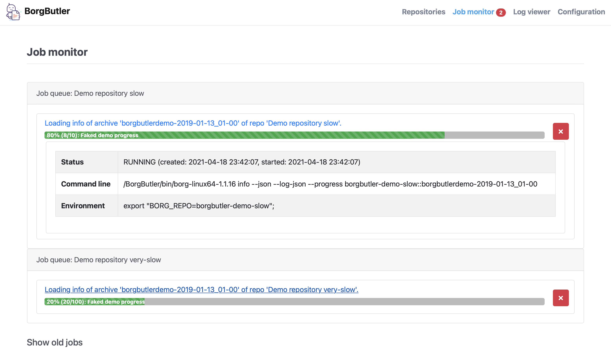
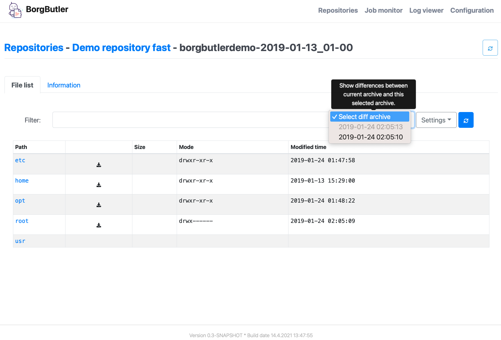

= Micromata BorgBackup-Butler
Micromata GmbH, Kai Reinhard
:toc:
:toclevels: 4

Copyright (C) 2018-2022

ifdef::env-github,env-browser[:outfilesuffix: .adoc]

== Why?

* Accessing your borg backups in an very convenient and fast way.
* Caches remote repo archive information for fast browsing.
* Differ functionality to see the differences of backups (files, directories etc.)

== At first glance

After starting BorgButler without any further settings, you can play with faked demo repositories.

[#img-configuration]
You may leave the default values as they are. BorgButler downloads the current or configured version of the borg binary for
your platform automatically.
[link=doc/images/screen-configuration.png]

[#img-jobmonitor]
The job monitor gives an overview of all (long running) processes. You're also able to cancel running jobs.
[link=doc/images/screen-jobmonitor.png]

[#img-repositories]
Borgbutler may manage multiple repositories.
[link=doc/images/screen-repositories.png]

[#img-repository-config]
Configuration of a repo used by BorgButler.
[link=doc/images/screen-repository-config.png]

[#img-repository-archives]
Overview of available archives in your BorgBackup repo.
[link=doc/images/screen-repository-archives.png]

[#img-archive-filelist]
The content of an archive (browseable as tree, searchable). You are also able to compare to archives and see the difference
with a view clicks. You may download single files as well as whole directories.
[link=doc/images/screen-archive-filelist.png]

[#img-archive-differences]
You may compare two archives within some clicks and see the differences (files, file properties such as size, dates or change modes).
[link=doc/images/screen-archive-differences.png]

== Quick start
=== Docker

BorgButler working directory `$HOME/BorgButler` is assumed, but you may define any other.

1. Create your local BorgButler directory: `mkdir $HOME/BorgButler` (for config, caches, backups and restoring of backuped files and directories)
2. `docker run -v $HOME/BorgButler:/BorgButler -v  $HOME/.ssh:/home/borgbutler/.ssh:ro -p 127.0.0.1:9042:9042 --name borgbutler micromata/borgbutler` (exporting of `.ssh` is useful for ssh remotes, otherwise skip this setting.)
3. Stopping: simly click `CTRL-C`.
4. Restart: `docker start`
5. Stop: `docker stop`

Enjoy BorgButler by opening your browser: http://localhost:9042

You may refer the log file through the web browser or in `${BorgButlerHome}/borgbutler.log`.

For new versions of BorgButler or for changing the running options of your BorgButler container, simply delete the BorgButler docker container by `docker rm borgbutler` and call `docker run` again.

=== Starting from Java zip
You'll need OpenJDK 9+.

1. Download BorgButler from https://sourceforge.net/projects/borgbutler/files/latest/download
2. Unzip `borgbutler-server/build/distributions/borgbutler-server-<version>.zip`
3. Run `bin/borgbutler-server` or `bin/borgbutler-server.bat`.

As BorgButler default home directory, `${HOME}/.borgbutler` is used.

=== Starting from sources
You'll need OpenJDK 9+ as well as gradle.

1. `gradle clean distZip`
2. Unzip `borgbutler-server/build/distributions/borgbutler-server-<version>.zip`
3. Run `bin/borgbutler-server` or `bin/borgbutler-server.bat`.

Enjoy BorgButler by opening your browser: http://localhost:9042

== Further information

=== Configuration
=== Example config file
You can configure it through the webapp or directly (`borgbutler.config`):

[source,yaml]
----
borgCommand: "${BorgButlerHome}/bin/borg-macosx64-1.1.9"
maxArchiveContentCacheCapacityMb: 200
repoConfigs:
- displayName: "ACME - Backup server 1"
  repo: "ssh://backupserver.acme.com:23/./backups/backup-server1"
  rsh: "ssh -i /BorgButler/.ssh/acme_rsa"
  passwordCommand: "security find-generic-password -a $USER -s borg-passphrase -w"
  id: "8af6c559b07d598af6c559b07d598af6c559b07d598af6c559b07d598af6c559"
- displayName: "ACME - Backup server 2"
  repo: "ssh://backupserver.acme.com:23/./backups/backup-server2"
  rsh: "ssh -i /BorgButler/.ssh/acme_rsa"
  passwordCommand: "security find-generic-password -a $USER -s borg-passphrase -w"
  id: "ae00099254dc44ae00099254dc44ae00099254dc44ae00099254dc44ae000992"
- displayName: "Debian - Backup server 1"
  repo: "ssh://kai@debian.acme.priv/opt/borg-backups/backup-server1"
  rsh: ""
  passwordCommand: "security find-generic-password -a $USER -s borg-passphrase -w"
  id: "not_yet_loaded_1"
port: 9042
showDemoRepos: false
----

== Example on how to script backups (Linux/MacOS)
Here: link:doc/ExampleBorgConfig{outfilesuffix}[Installation]

=== Backups of configuration files

You may configure and initialize your repositories by the BorgButler app. The config file is generated by BorgButler. Before
saving a new configuration BorgButler stores a copy of the current configuration in the backup dir: `${BorgButlerHome}/backup/`.

== More immpressions

See some more screens to get an first overview of the functionality of BorgButler.

[#img-repository-info]
Information about your repo.
[link=doc/images/screen-repository-info.png]

[#img-logviewer]
There is a log file available as well as an log viewer including search functionality.
[link=doc/images/screen-logviewer.png]

== Trouble shooting
=== Docker
==== Increase memory (OutOfMemory)
Edit `${BorgButlerHome}/environment.sh` and restart your docker container (since version 0.6).

[source,bash]
----
#!/bin/bash

export JAVA_OPTS=-DXmx4g
----

If your docker container crashes on heavy usage of large borg archives, check the memory settings of your docker installation.

=== How to download/restore?
You may restore files or while directories by simply clicking the download icon. If you run BorgButler on localhost as Java process (not docker), after restoring single
files or directories your system's file browser is opened.

You will find all the restored files in the `restore` subdirectory of your BorgButler home directory.

=== Access to Borg repo fails (lock)
BorgButler tries to run only one job per repo at the same time. If your log file shows error on `Failed to create/acquire the lock ... lock.exclusive (timeout)` simply restart BorgButler.

=== Browsing produces security warnings
Due to security reasons, BorgButler is only available by the localhost's web browser. For docker
installations the clients of the private net `172.17.0.*` are allowed.
For enabling other client ip's, you may use option `-DallowedClientIps=192.168.78.` (docker: `docker run -e JAVA_OPTS="-DallowedClientIps=192.168.78.;192.168.79.5" -v ...` if your really now what you're doing!!! There is now https available at default!!!
